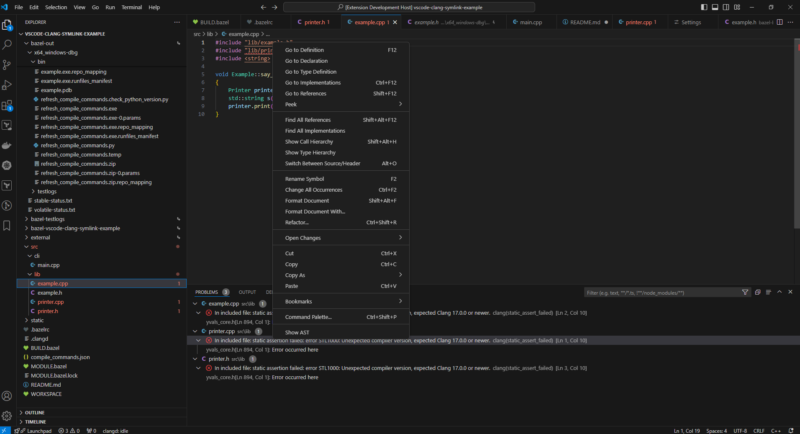
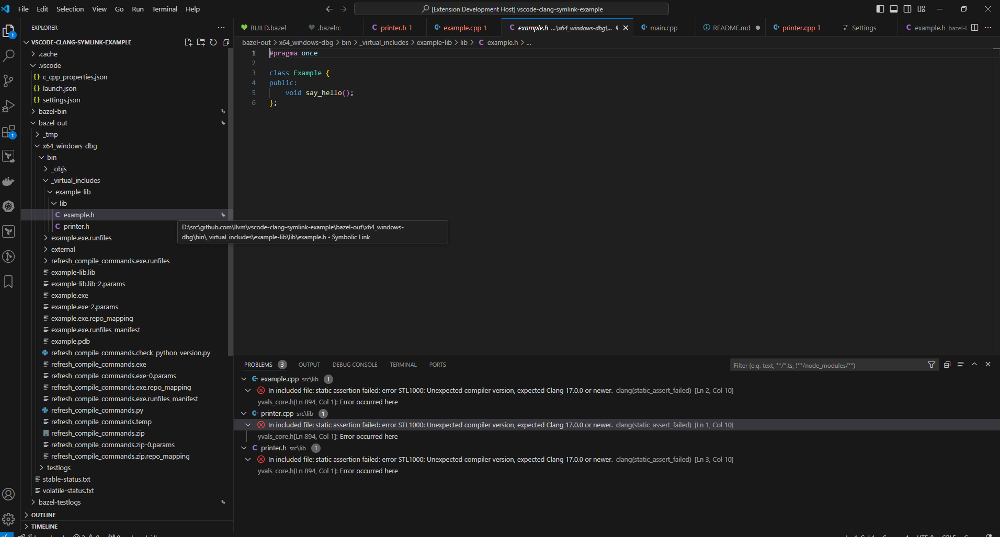
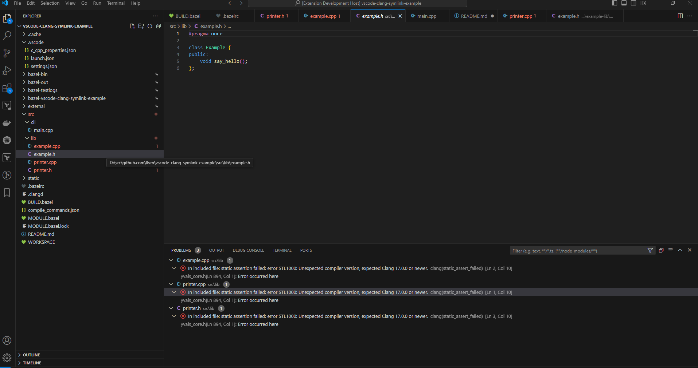

# VSCode ClangD symlink example

This repository is an example of the issues with LSP symbol resolution when using clangd in VSCode with Bazel.


## Requirements
* Bazel configured for your system [See Here](https://bazel.build/about/intro)


## Usage:

* Build the example to generate the bazel intermediate files
```sh
bazel build :example
```
* Generate a `compile-commands.json` using [Hedrons](https://github.com/hedronvision/bazel-compile-commands-extractor) excellent bazel clangd tools
```sh
bazel run :refresh_compile_commands
```
* Enable/Disable "Follow Symlinks" in clangd's extension settings to see the behavior on "Go To Definition", "Go To Declartion" etc...


## Example


### Without Symlink Following



### With Symlink Following
